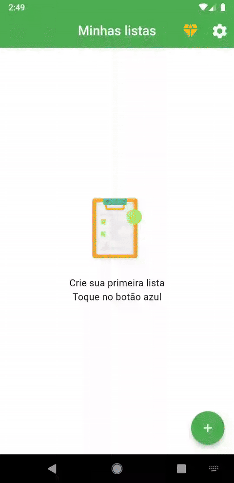
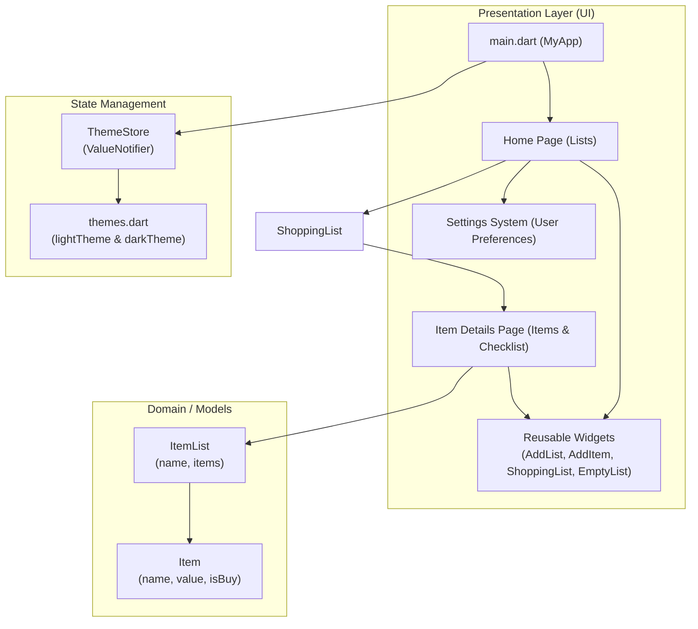

# 🛒 Shopping List App

[](https://flutter.dev/)
[](https://dart.dev/)
[](https://m3.material.io/)
[](https://api.flutter.dev/flutter/foundation/ValueNotifier-class.html)
[](LICENSE)

> 🇧🇷 [**Português**](README.md) | 🇺🇸 **English Version**

Mobile application developed in Flutter for creating, managing, and intelligently tracking shopping lists. It enables organizing multiple items, tracking planned and purchased totals in real time, accurately calculating expenses, and toggling between light, dark, or system-matching themes.

## 📌 Quick Navigation

- [📝 About the Project](#-about-the-project)
- [🖼️ Preview](#️-preview)
- [✨ Features](#-features)
- [🛠️ Technologies and Tools Used](#️-technologies-and-tools-used)
- [🏛️ Solution Architecture](#️-solution-architecture)
- [📁 Repository Structure](#-repository-structure)
- [💡 Technical Decisions](#-technical-decisions)
- [🚀 How to Run the Project](#-how-to-run-the-project)

## 📝 About the Project

The **Shopping List App** is an intuitive, modern mobile solution built to simplify everyday grocery shopping and expense budgeting. Designed for seamless store interactions, it enables users to create distinct lists (e.g., *Supermarket*, *Farmers Market*, *Barbecue*), register items with monetary values, and mark items off as they are added to the cart.

In addition, it provides an instant financial summary comparing pending items with completed purchases, keeping users fully in control of their spending.

## 🖼️ Preview

<div align="center">
  
</div>

## ✨ Features

- 📋 **List Management**: Create and track multiple shopping lists simultaneously.
- ➕ **Item Registration with Pricing**: Easily add products with form validation for name and unit price.
- ✅ **Interactive Checklist**: Mark items as purchased or pending with immediate UI updates.
- 📊 **Progress Tracker**: Visual linear progress bar and dynamic counter on each list card indicating completed purchases.
- 💰 **Real-time Financial Calculations**: Automatic cost calculation categorized into "Marked" (purchased) and "Unmarked" (pending) totals.
- 🌓 **Dynamic Theme Switching**: Seamless toggle between Light, Dark, or System theme modes.
- 🔤 **Custom Typography**: Integrated Montserrat font family for enhanced visual branding.

## 🛠️ Technologies and Tools Used

| Layer / Purpose | Technology | Description |
| :--- | :--- | :--- |
| **Main Framework** | **Flutter (SDK ^3.10.7)** | Reactive cross-platform framework for high-performance native UIs |
| **Programming Language** | **Dart 3.x** | Strongly typed, object-oriented language with Null Safety support |
| **Design System** | **Material Design 3** | Modern visual components, consistent theming, and accessibility |
| **State Management** | **ValueNotifier & Listenable** | Lightweight reactive state handling for dynamic theme toggling |
| **Typography & Assets** | **Montserrat & Custom Icons** | Local custom fonts with Material & Cupertino vector iconography |
| **Automated Testing** | **Flutter Test (Widget Testing)** | Built-in test harness for UI widget verification and smoke tests |
| **Build & Dependency Management** | **Pub / pubspec.yaml** | Package management, asset declaration, and dependency resolution |

## 🏛️ Solution Architecture

The project follows a clean, modular structure separating data models, reactive controllers (stores), reusable components (widgets), and screen views (pages).



## 📁 Repository Structure

```text
6-app-lista-de-compras-estilizado/
├── assets/
│   ├── fonts/
│   │   └── Montserrat/
│   │       └── Montserrat-Black.ttf
│   └── images/
│       ├── lista-de-compras.gif
│       └── lista-de-compras.png
├── lib/
│   ├── main.dart                      # Application entry point
│   ├── model/                         # Data model definitions
│   │   ├── item.model.dart            # Item entity with status and price
│   │   └── item_list.model.dart       # Shopping list container entity
│   ├── pages/                         # Main screen views
│   │   ├── home.page.dart             # Home view displaying all lists
│   │   └── item_details.page.dart     # List detail view with checklist & calculations
│   ├── stores/                        # Reactive state stores
│   │   └── theme.store.dart           # Theme controller (ValueNotifier)
│   ├── themes/                        # Styling definitions & palettes
│   │   └── themes.dart                # Light and Dark theme configurations
│   └── widgets/                       # Reusable UI components
│       ├── add_item.widget.dart       # Bottom sheet modal for item creation
│       ├── add_list.widget.dart       # Full-screen dialog for new list creation
│       ├── empty_list.widget.dart     # Empty state placeholder
│       ├── settings_system.widget.dart# User preference and appearance selector
│       └── shopping_list.widget.dart  # List view card with progress indicator
├── test/
│   └── widget_test.dart               # Automated widget smoke tests
├── pubspec.yaml                       # Project metadata, dependencies, and assets
└── README.md                          # Project documentation
```

## 💡 Technical Decisions

- **Lightweight State Handling with ValueNotifier**: The application theme switching (Light, Dark, and System mode) uses `ValueNotifier<ThemeMode>` and `ValueListenableBuilder`, avoiding the overhead of heavy third-party state libraries.
- **Component Reusability & Isolation**: Input modals (`AddItem`), full-screen creation pages (`AddList`), and empty state views (`EmptyList`) were decoupled into isolated widgets for maintainability and testing ease.
- **Immediate Visual Feedback**: Dynamic purchase calculations instantly feed the `LinearProgressIndicator` and item counters on list cards, delivering clear visual cues as shopping progresses.
- **Theme Accessibility & Custom Typography**: Complete dark mode styling with high-contrast surfaces alongside Montserrat typography ensures visual comfort across all ambient lighting conditions.

## 🚀 How to Run the Project

### Prerequisites

- [Flutter SDK](https://docs.flutter.dev/get-started/install) installed (version 3.10 or higher)
- Compatible [Dart SDK](https://dart.dev/get-dart)
- Configured Android/iOS emulator or connected physical device
- Code editor (VS Code or Android Studio) with Flutter & Dart extensions

### Step-by-Step Instructions

1. **Clone the repository:**
   ```bash
   git clone https://github.com/ludson96/6-app-lista-de-compras-estilizado.git
   cd 6-app-lista-de-compras-estilizado
   ```

2. **Install dependencies:**
   ```bash
   flutter pub get
   ```

3. **Check connected devices:**
   ```bash
   flutter devices
   ```

4. **Launch the application:**
   ```bash
   flutter run
   ```

5. **Run automated tests:**
   ```bash
   flutter test
   ```

<div align="center">
  Developed by <strong>Ludson Pereira dos Santos</strong> 🚀<br />
  <a href="https://www.linkedin.com/in/ludson96/">LinkedIn</a> • <a href="https://github.com/ludson96">GitHub</a> • <a href="mailto:ludson_ps27@hotmail.com">Email</a>
</div>
