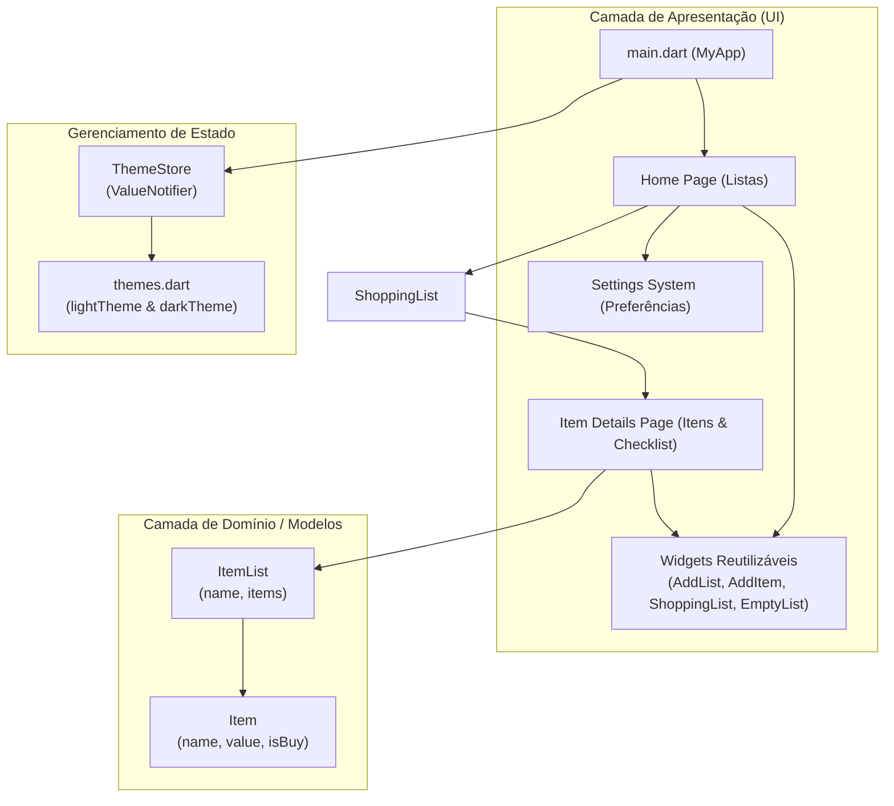

# 🛒 App Lista de Compras

[](https://flutter.dev/)
[](https://dart.dev/)
[](https://m3.material.io/)
[](https://api.flutter.dev/flutter/foundation/ValueNotifier-class.html)

> 🇧🇷 **Português** | 🇺🇸 [**English Version**](README.en.md)

Aplicativo mobile desenvolvido em Flutter para criação, gerenciamento e controle inteligente de listas de compras. Permite organizar múltiplos itens, acompanhar o total planejado e comprado em tempo real, calcular gastos com precisão e alternar entre temas claro, escuro ou automático do sistema.

## 📌 Navegação Rápida

- [📝 Sobre o Projeto](#-sobre-o-projeto)
- [🖼️ Preview](#️-preview)
- [✨ Funcionalidades](#-funcionalidades)
- [🛠️ Tecnologias e Ferramentas Utilizadas](#️-tecnologias-e-ferramentas-utilizadas)
- [🏛️ Arquitetura da Solução](#️-arquitetura-da-solução)
- [📁 Estrutura do Repositório](#-estrutura-do-repositório)
- [💡 Decisões Técnicas](#-decisões-técnicas)
- [🚀 Como Executar o Projeto](#-como-executar-o-projeto)

## 📝 Sobre o Projeto

O **App Lista de Compras** é uma solução mobile intuitiva e moderna focada em simplificar as compras do dia a dia. O aplicativo foi projetado para oferecer uma experiência ágil no supermercado e no comércio em geral, possibilitando criar diferentes listas (ex.: *Supermercado*, *Feira*, *Churrasco*), adicionar itens com seus respectivos valores monetários e marcar itens à medida que são colocados no carrinho.

Além disso, disponibiliza um resumo financeiro instantâneo com a soma dos itens pendentes e dos itens já comprados, facilitando o controle orçamentário em tempo real.

## 🖼️ Preview


## ✨ Funcionalidades

- 📋 **Gerenciamento de Listas**: Criação e visualização de múltiplas listas de compras simultâneas.
- ➕ **Cadastro de Itens com Preço**: Inclusão rápida de produtos com validação de nome e valor em Reais (R$).
- ✅ **Marcação Interativa (Checklist)**: Alternância de status dos itens (comprado / pendente) com atualização visual imediata.
- 📊 **Indicador de Progresso**: Barra de progresso linear e contador em cada lista indicando quantos itens já foram adquiridos.
- 💰 **Cálculo Financeiro em Tempo Real**: Totalização automática separada entre itens "Marcados" (comprados) e "Não marcados" (pendentes).
- 🌓 **Suporte a Temas Personalizados**: Troca dinâmica entre tema Claro (Light), Escuro (Dark) ou padrão do Sistema operacional.
- 🔤 **Tipografia Customizada**: Integração com a família tipográfica Montserrat.

## 🛠️ Tecnologias e Ferramentas Utilizadas

| Camada / Finalidade | Tecnologia | Descrição |
| :--- | :--- | :--- |
| **Framework Principal** | **Flutter (SDK ^3.10.7)** | Framework cross-platform reativo para interfaces nativas de alto desempenho |
| **Linguagem de Programação** | **Dart 3.x** | Linguagem tipada e orientada a objetos otimizada para interfaces com Null Safety |
| **Design System** | **Material Design 3** | Componentes visuais modernos, estilização consistente e acessibilidade |
| **Gerenciamento de Estado** | **ValueNotifier & Listenable** | Gestão de estado reativa e leve para controle dinâmico de temas |
| **Tipografia & Assets** | **Montserrat & Custom Icons** | Fontes personalizadas locais e ícones vetoriais Material & Cupertino |
| **Testes Automatizados** | **Flutter Test (Widget Testing)** | Suporte integrado para testes de widgets e integração de componentes |
| **Gerenciador de Dependências** | **Pub / pubspec.yaml** | Gerenciamento de pacotes, assets e fontes do ecossistema Flutter |

## 🏛️ Arquitetura da Solução

O projeto segue uma organização em camadas simples e modular, separando modelos de dados, controladores reativos (stores), componentes visuais reutilizáveis (widgets) e telas (pages).



## 📁 Estrutura do Repositório

```text
6-app-lista-de-compras-estilizado/
├── assets/
│   ├── fonts/
│   │   └── Montserrat/
│   │       └── Montserrat-Black.ttf
│   └── images/
│       ├── lista-de-compras.gif
│       └── lista-de-compras.png
├── lib/
│   ├── main.dart                      # Ponto de entrada da aplicação
│   ├── model/                         # Modelos de dados
│   │   ├── item.model.dart            # Modelo de item com status e valor
│   │   └── item_list.model.dart       # Modelo de lista agrupando itens
│   ├── pages/                         # Telas da aplicação
│   │   ├── home.page.dart             # Tela principal com listagem de listas
│   │   └── item_details.page.dart     # Detalhamento de itens, valores e checklist
│   ├── stores/                        # Gerenciamento de estado reativo
│   │   └── theme.store.dart           # Controlador de tema (ValueNotifier)
│   ├── themes/                        # Definições de estilo e paletas
│   │   └── themes.dart                # Configuração do Light & Dark Theme
│   └── widgets/                       # Componentes de interface reutilizáveis
│       ├── add_item.widget.dart       # Modal para criação de item
│       ├── add_list.widget.dart       # Tela de criação de nova lista
│       ├── empty_list.widget.dart     # Estado vazio quando não há listas
│       ├── settings_system.widget.dart# Tela de preferências de aparência
│       └── shopping_list.widget.dart  # Card e progresso de cada lista
├── test/
│   └── widget_test.dart               # Testes de widgets
├── pubspec.yaml                       # Dependências, fontes e assets do projeto
└── README.md                          # Documentação do projeto
```

## 💡 Decisões Técnicas

- **Estado Leve com ValueNotifier**: A alternância de temas (Claro, Escuro e Sistema) utiliza `ValueNotifier<ThemeMode>` e `ValueListenableBuilder` para fornecer reatividade rápida e sem a sobrecarga de bibliotecas externas pesadas.
- **Componentização e Reutilização**: Modais de entrada (`AddItem`), formulários em tela cheia (`AddList`) e visualizações de estado vazio (`EmptyList`) foram isolados em widgets dedicados, facilitando manutenções e testes.
- **Feedback Visual de Progresso**: O cálculo percentual de itens concluídos atualiza o `LinearProgressIndicator` e contadores no card da lista, proporcionando retorno visual intuitivo do andamento das compras.
- **Acessibilidade e Customização de Temas**: O suporte nativo ao modo escuro com paleta de alto contraste e fontes personalizadas assegura legibilidade e conforto visual em diferentes condições de iluminação.

## 🚀 Como Executar o Projeto

### Pré-requisitos

- [Flutter SDK](https://docs.flutter.dev/get-started/install) instalado (versão 3.10 ou superior)
- [Dart SDK](https://dart.dev/get-dart) compatível
- Emulador Android / iOS configurado ou dispositivo físico conectado
- Editor de código (VS Code ou Android Studio) com plugins Flutter e Dart

### Passo a Passo

1. **Clone o repositório:**
   ```bash
   git clone https://github.com/ludson96/6-app-lista-de-compras-estilizado.git
   cd 6-app-lista-de-compras-estilizado
   ```

2. **Instale as dependências:**
   ```bash
   flutter pub get
   ```

3. **Verifique os dispositivos conectados:**
   ```bash
   flutter devices
   ```

4. **Execute o aplicativo:**
   ```bash
   flutter run
   ```

5. **Executar testes:**
   ```bash
   flutter test
   ```

<div align="center">
  Desenvolvido por <strong>Ludson Pereira dos Santos</strong> 🚀<br />
  <a href="https://www.linkedin.com/in/ludson96/">LinkedIn</a> • <a href="https://github.com/ludson96">GitHub</a> • <a href="mailto:ludson_ps27@hotmail.com">E-mail</a>
</div>
